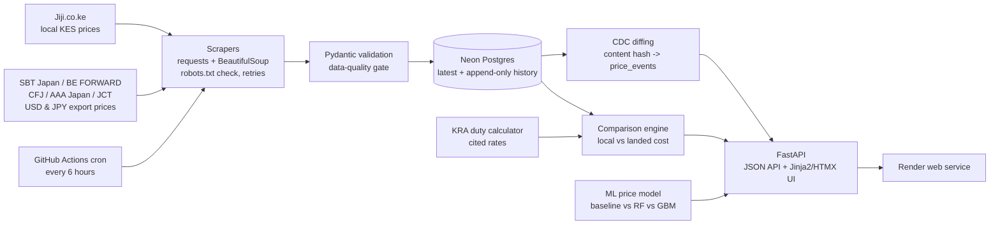

# Car Imports Advisor

Compare the true landed cost of importing a car from Japan to Kenya against
local marketplace prices — backed by a real data pipeline (scraping, CDC
price tracking) and an ML price-prediction model.

**Track:** fullstack Data Science & Data Engineering. The halves are labelled
throughout this README: [DE] marks data-engineering components, [DS] marks
data-science components.

## Architecture



## The core question: local vs import

The pipeline scrapes **both sides of the market** and puts them side by side:

- **Local**: Jiji.co.ke listings (KES).
- **Japan-side exporters**: SBT Japan, BE FORWARD, Car From Japan (USD);
  AAA Japan (JPY); Japanese Car Trade's Kenya-facing stock (USD).

`src/comparison.py` matches cars that appear on both sides (same normalised
make, compatible model tokens, model year within 1 year), then estimates the
full landed cost of the Japan unit: exporter price + estimated Roro freight
to Mombasa (documented US$1,600 estimate) + KRA duties (import, excise,
VAT, IDF, RDL — cited rates) + port/clearing fees, and reports the
difference against the local asking price. Unmatched local cars are skipped
rather than force-matched.

Run `python scripts/run_pipeline.py --pages 3`, then open **/comparisons**
(or `GET /api/comparisons`) for the live table. With one page per site you
get ~115 listings and a handful of pairs; deeper scrapes widen the pool.

- [DE] **Scraping** (`src/scrapers/`): a `BaseScraper` contract with polite
  fetching (rate limiting, exponential backoff via `tenacity`, no retry when
  blocked 403/429), a `robots.txt` check before any crawl, and per-field
  parsing that records `parse_warnings` instead of inventing values.
  `JijiScraper` is the first source; the interface is designed so a second
  marketplace is one new subclass.
- [DE] **Validation** (`src/schemas.py`): every scraped row must pass a
  pydantic schema (plausible years, prices, mileage) before storage. The same
  schemas double as the API response models.
- [DE] **CDC** (`src/cdc.py`): no webhooks exist for scraped sites, so change
  capture is scheduled polling + diffing — a sha256 content hash per listing,
  an append-only `listings_history` table (SCD2-style), and a `price_events`
  table whenever a price moves. The honest, appropriately-scoped pattern for
  this data source; no Kafka/Debezium theatre.
- [DE] **Storage** (`src/db_utils.py` + `migrations/`): SQLAlchemy ORM over
  Neon Postgres in deployment, SQLite locally. Numbered SQL migrations are
  applied idempotently at startup. `DATABASE_URL` switches environments.
- [DE] **Orchestration** (`scripts/run_pipeline.py`,
  `.github/workflows/scrape.yml`): one CLI entrypoint — scrape → validate →
  store → diff — invoked identically by the GitHub Actions cron (every 6 h)
  and by developers locally.
- [DS] **Model** (`src/ml_model.py`): engineered features (car age,
  mileage/year), a three-way comparison (median baseline vs Random Forest vs
  Gradient Boosting) on a shared split, versioned artifacts
  (`models/car_price_model_<ts>.pkl` + `latest` pointer for rollback), and a
  JSON run log of params/metrics per training run.
- [DS→DE feedback] **Drift signal**: `GET /api/health` reports the served
  model version and last scrape status; the CDC price stream is the basis for
  retraining recommendations as history accumulates.
- **API + frontend** (`app/`): one FastAPI service serves the JSON API *and*
  the server-rendered Jinja2/HTMX UI — no Streamlit, no separate frontend
  build, one cold start to worry about.

## API

Interactive OpenAPI docs at `/docs` when the app is running.

| Method | Path | Purpose |
|---|---|---|
| GET | `/api/health` | Last scrape status + served model version + drift flag |
| POST | `/api/predict` | Car spec → predicted FOB price (JPY) |
| POST | `/api/calculate` | JPY price + engine → full KES duty breakdown |
| GET | `/api/listings` | Latest listings (`?source=&limit=`) |
| GET | `/api/listings/{id}/history` | Per-listing observation history |
| GET | `/api/price-events` | Detected price changes, biggest moves first |
| GET | `/api/comparisons` | Local vs import landed-cost comparisons (bulk) |
| GET | `/api/catalog/makes` | Local-market makes (dashboard select 1) |
| GET | `/api/catalog/models` | Models for a make (`?make=`) |
| GET | `/api/catalog/years` | Import-eligible years (`?make=&model=`) |
| GET | `/api/comparison` | One user-chosen car (`?make=&model=&year=`) |
| GET | `/api/drift` | PSI drift report for the CDC price stream |
| POST | `/api/admin/trigger-scrape` | Kick off a scrape (BackgroundTasks) |
| POST | `/api/admin/seed-demo-data` | **Explicit** clearly-labelled demo data |

Mock data policy: the demo generator (`src/mock_data.py`) is reachable only
through the explicit seed endpoint/CLI flag — never as a silent fallback
inside a scraper. Failed scrapes surface errors in logs and API responses.

## Compare dashboard (UI)

`/dashboard` lets a user pick **make → model → year** from cascading HTMX
selects fed by the live catalog, then shows the local-vs-import verdict for
that exact car: local Jiji price next to the exporter unit's full landed
cost, with an expandable duty breakdown. Only combinations that exist in
the latest scrape are selectable, and year options start at Kenya's import
floor.

## Kenya's 8-year import rule

Vehicles more than 8 years old (year of manufacture) cannot be imported
under KEBS/BVRS pre-export verification. The comparison layer therefore
excludes exporter listings older than `current_year - 8` (2018 in 2026) —
the floor is computed from the clock, so it rolls forward automatically,
and a unit that would "win" on price but is illegal to import is never
shown as a deal.

## Drift monitoring & retraining

`src/drift.py` watches the CDC price stream. At training time the feature
distributions (price, car age, mileage/year, engine size) are captured as
quantile-bin references; each check compares the newest observation per
listing against that reference using the Population Stability Index
(PSI). Conventional thresholds: < 0.1 stable, 0.1–0.25 watch, > 0.25
action. When any feature crosses the action threshold with enough live
rows (≥ 30), `retraining_recommended` flips to true on `/api/drift` and
`/api/health` — a signal to retrain on fresh scraped data, not an
automatic retrain.

## Duty calculator transparency

All rates are cited module constants in `src/calculator.py` (Import Duty 25%,
Excise 20/30/35% by engine band, VAT 16%, IDF 3.5%, RDL 2%), with a
`rates_last_reviewed` stamp returned in every API response. The JPY→KES rate
is fetched live and, when the FX API is unreachable, a documented fallback is
used and **flagged as an estimate** (`fx_is_estimate: true`) rather than
passed off as live.

## Run locally

```bash
python -m venv venv && source venv/bin/activate
pip install -r requirements.txt

# run tests + lint
pytest
pylint src app scripts

# seed demo data (explicit) and train
python scripts/run_pipeline.py --seed-demo
python - <<'PY'
from src.db_utils import load_dataframe
from src.ml_model import train_and_save_model
train_and_save_model(load_dataframe("demo_listings"))
PY

# serve API + UI
uvicorn app.main:app --reload
```

## Deployment

| Component | Where | Why |
|---|---|---|
| FastAPI app (API + UI) | Render free web service (`render.yaml`) | Persistent Python process for Jinja2 pages + DB pool; one cold start, not two |
| Scheduled scrape/CDC | GitHub Actions cron | Free, versioned with the code, no idle service |
| Database | Neon Postgres free tier | One persistent DB shared by the app and the cron job via `DATABASE_URL` |

Set `DATABASE_URL` (Neon connection string, `sslmode=require`) as a secret
in both Render and GitHub Actions so the app and the scheduled job provably
read/write the same data. Locally, put it in `.env` (gitignored) — it is
loaded automatically at import time; real environment variables always win.
CI includes a `neon-smoke` job that connects with the secret, applies the
schema and verifies all four tables exist.

## Known limitations

Named explicitly, because free-tier portfolios deserve honesty:

- Render free services cold-start (~30–60 s) after inactivity.
- Scraping depth is bounded (a few pages per site per run); the `BaseScraper`
  interface exists so more depth or more sources are small incremental changes.
- Freight is a documented per-unit estimate, not a per-quote figure; the FX
  API is a free tier and falls back to flagged constants when unreachable.
- Drift monitoring is simplified: the CDC price stream feeds distribution
  comparisons rather than a full monitoring stack (evidently/alibi-detect).
- The duty calculator reflects rates reviewed 2026-09; verify with KRA before
  relying on any figure for an actual purchase.
- Test coverage focuses on calculator math, schema validation, CDC diffing,
  and API behaviour; live scrapers are integration-tested manually to avoid
  flaky CI dependent on third-party uptime.
